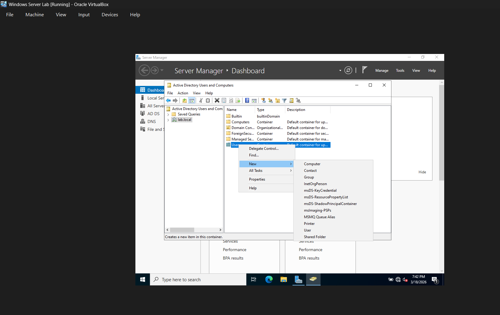
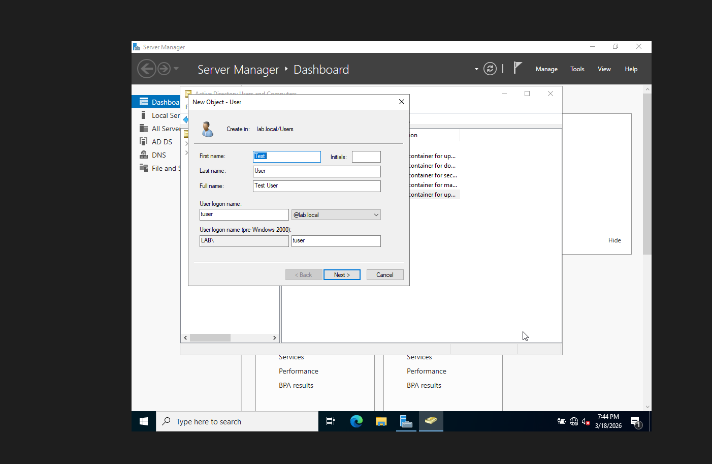
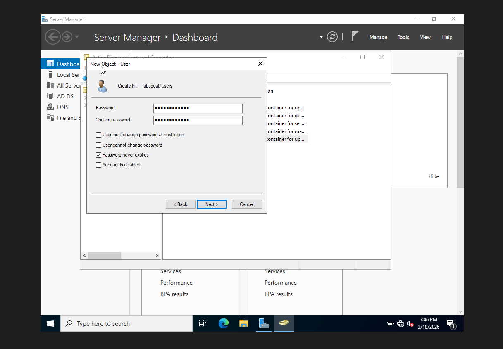
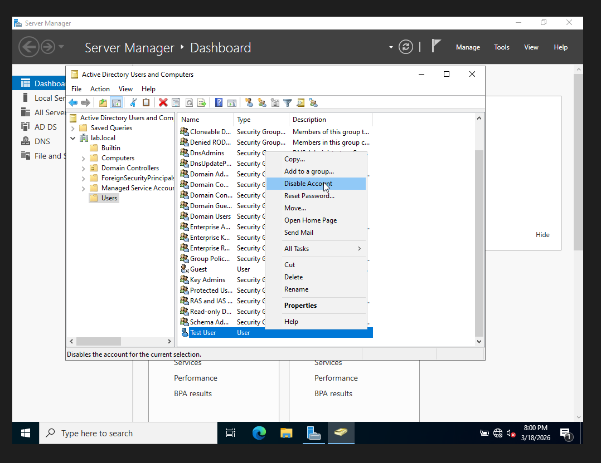
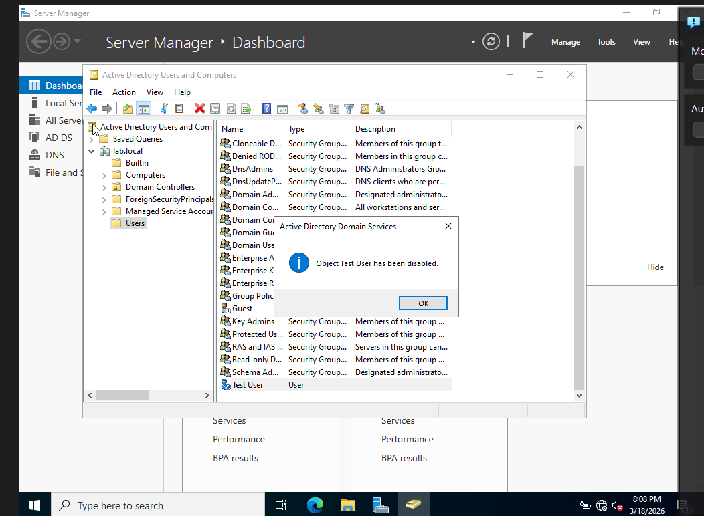
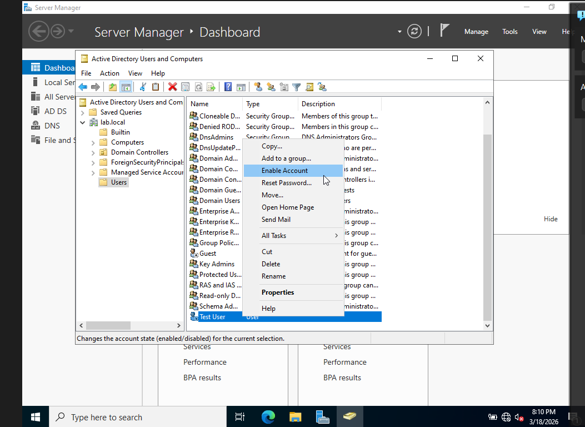
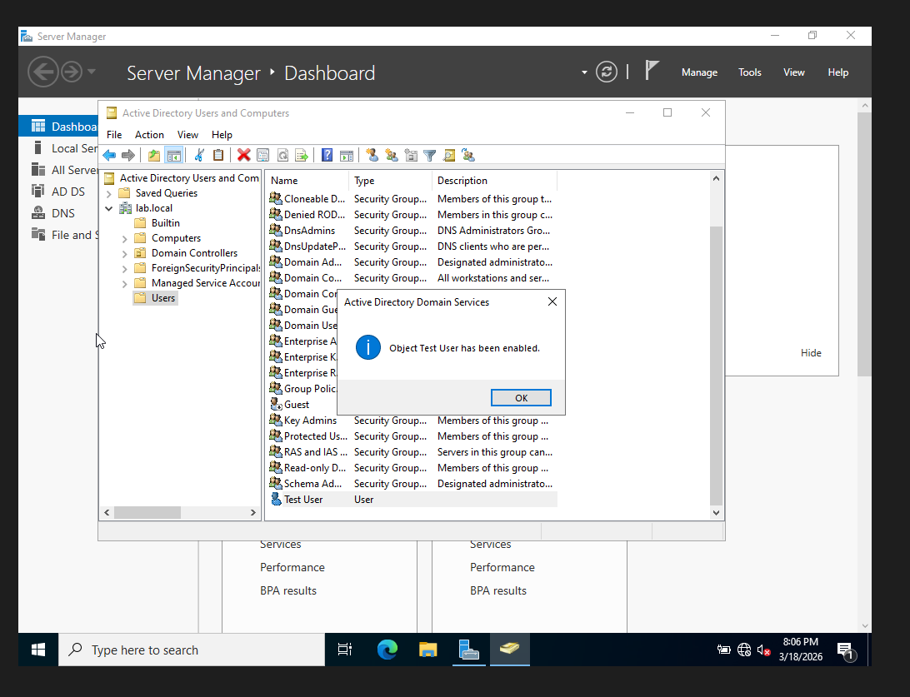

# My-Active-Directory-Lab
Welcome to my Active Directory Home Lab. It was built in a Windows VM Environment to practice and show User Management, Password Resets, and Group Permissions

## What I Did
- Installed Windows Server 2022 in a virtual machine
- Promoted server to Domain Controller (lab.local)
- Created and managed user accounts
- Reset user passwords and unlocked accounts
- Assigned users to security groups (Domain Admins)
- Verified group membership and permissions

## Tools Used
- Oracle VirtualBox
- Windows Server 2022
- Active Directory Users and Computers

## Skills I was able to show off
- User account management
- Password reset procedures
- Group permissions
- Troubleshooting directory issues
- Basic system administration

## Screenshots

### Creating Users

### Disable Accounts

### Enable Accounts

